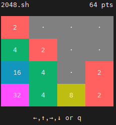

## 2048.sh

Bash version of the game "2048"

Tested on Ubuntu 20.04.3 LTS

Source algorithm derived from https://github.com/mevdschee/2048.c.git

It can easily compariable with C equivalent, names(function, variable etc..) and code itself left same as original

